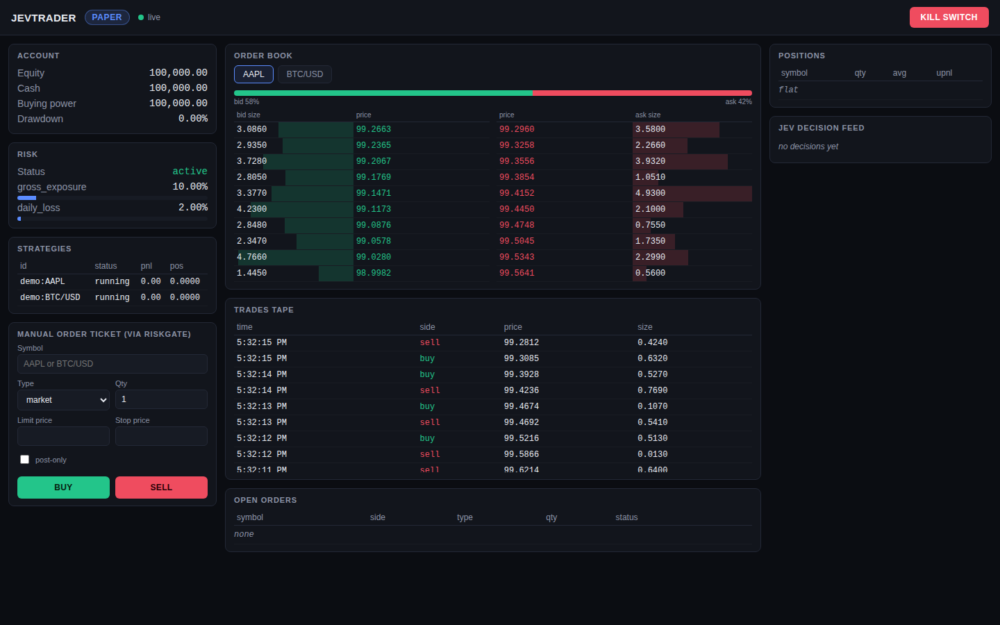

# JevTrader

A **local-only**, fee-aware quant trading stack for US stocks and crypto on Alpaca. It runs on your own machine, with no cloud server.

* **One strategy class for every mode:** the same code runs in backtest, then paper, then live.
* **"The model judges, the code executes":** a typed decision model (Jev, Kev or Laya) and TimesFM forecasts supply calibrated probabilities. Thresholds, sizing and risk limits stay in plain Python.
* **Every fill pays realistic fees:** Alpaca's crypto maker/taker tiers, SEC/FINRA fees on stocks, spread, slippage, and queue position for resting limit orders.
* **Gated promotion:** backtest (walk-forward, deflated Sharpe, fee stress) → paper (≥ 20 trading days, paper costs must match backtest costs) → live (starts small, then scales up).
* **A risk engine sits between every strategy and the broker:** position/exposure caps, daily-loss and drawdown halts, a kill switch, fat-finger price bands, and order throttling.



## Quick start

```bash
python -m venv .venv && . .venv/bin/activate
pip install -e ".[dev]"            # + ".[forecast]" for TimesFM 2.5
cp .env.example .env               # add ALPACA paper keys (and TYPESAFE_API_KEY if using hosted Jev)

jev dashboard-demo                 # see the UI with synthetic data, no keys needed
jev strategies                     # the strategy library
jev fetch BTC/USD --start 2025-01-01 --timeframe 1Min      # Alpaca history -> local cache
jev backtest zscore_reversion -s AAPL --data cache --start 2026-01-01 --end 2026-09-01
jev paper smart_rebalance -s SPY -s QQQ -s TLT -s GLD -s BTC/USD --shadow kev
jev ping --backend kev             # decision-model latency check
pytest                             # 571 offline tests
```

Paper trading journals orders, fills, decisions, equity, and real quotes/L2 books into `runs/`. After a few weeks:

```bash
jev promote paper <strategy_id> --report runs/backtests/<report>.json
jev promote live  <strategy_id> --run runs/<run_id>
JEV_LIVE_CONFIRM=I_UNDERSTAND_THIS_IS_REAL_MONEY jev live <strategy> -s ...
```

The live broker refuses to start without both the confirm phrase and a passing promotion record.

## What the research found (read this before funding)

Full evidence is in [docs/STRATEGIES.md](docs/STRATEGIES.md) and [research_reports/](research_reports/). The data was real: 20 months of BTC/USD 1-minute bars, plus 6 months of SPX500 and Citigroup 1-minute bars. Splits were chronological 60/20/20, and the holdout was touched once. All numbers are net of costs.

* **Alpaca crypto fees kill intraday crypto trading.** Tier 1 is 15 bps maker / 25 bps taker, so a round trip costs 30–50 bps before spread. Every intraday BTC strategy tested had a gross edge of ≤ 5–15 bps per round trip; they only break even at 1–7 bps per side. Hold crypto through the low-turnover **smart rebalancer**, not intraday strategies.
* **True HFT is not possible from a retail Alpaca account** (latency plus fees). The highest-frequency realistic play is maker-only quoting on liquid US equities (`as_market_maker`, `imbalance_alpha` in join mode). Its edge can only be measured on real order books, so paper trading records them (`--record`, on by default) and `jevtrader.research.record_replay` replays them through the backtester.
* **Best candidate:** 15-minute z-score mean reversion on volatile single stocks is **MARGINAL** (holdout Sharpe positive, but only ~12 trades per split). Paper-trade it small and re-validate on ≥ 1 year of Alpaca history.
* Trend, breakout, squeeze, seasonality and BTC→SPX lead-lag strategies are **NOT VIABLE** out of sample. They stay in the library with their evidence.
* **Suggested paper lineup:** 60% smart_rebalance (crypto ≤ 15%), 25% zscore_reversion on 4–6 stocks, 10% tiny equity market-making to collect real fills, plus the recorder. See docs/STRATEGIES.md §4.

## Decision models: Jev → Kev / Laya (fine-tuned to beat it)

Kev ([jaredpalmer/kev](https://github.com/jaredpalmer/kev)) and Laya ([NandhaKishorM/laya](https://github.com/NandhaKishorM/laya)) serve the same `/v1/systemone` API as hosted Jev. Switching is `DECISION_BACKEND=kev|laya` in `.env`, with no code changes.

1. **Build the dataset:** `scripts/finetune/build_dataset.py` labels each state with what the market actually did afterwards, net of costs. It uses the exact state builder the live bot uses, with an embargo between splits.
2. **Fine-tune:** `scripts/finetune/kev_finetune.sh` (runs on CUDA or a Mac, starting from `--init_from jaredpalmer/kev-4b`), or the Laya notebook, or the Modal option for a rented GPU.
3. **Compare:** `scripts/finetune/scoreboard.py` scores Jev vs Kev vs Laya vs TimesFM vs a logistic-regression baseline on the untouched test split. A challenger replaces the incumbent only if it has a lower Brier score, a higher after-cost edge, **and** a lower p95 latency.
4. **Shadow in paper:** `jev paper ... --shadow kev --shadow laya` logs every backend's answer on identical live states.

Latency depends on hardware: Kev-4B takes ~20–40 ms on an NVIDIA GPU, Kev-0.8B ~150 ms on a Mac, and hosted Jev ~250 ms plus network. See [docs/DECISION_MODELS.md](docs/DECISION_MODELS.md).

## TimesFM forecasting layer

TimesFM 2.5 (Apache-2.0) produces quantile forecasts of returns, volatility and volume. These feed the decision-model state (`tfm_*` features), risk sizing, and market-maker spread width. It can also be scored standalone as `ForecastAdvisor`.

TimesFM 3.0 weights are **non-commercial and non-production**. The code refuses to use them outside backtests unless you explicitly acknowledge that.

GARCH, EWMA and random-walk baselines are built in. On real BTC data, 5–15 minute volatility is hard to beat, and short-horizon direction is essentially a random walk. See [docs/FORECASTING.md](docs/FORECASTING.md).

## Layout

See [docs/ARCHITECTURE.md](docs/ARCHITECTURE.md).

| package | contents |
|---|---|
| `core` | contracts |
| `data` | synthetic data, Alpaca history, cache |
| `backtest` | engine, SimBroker, metrics, walk-forward |
| `jev` | advisors, backends, shadow mode, calibration, fine-tuning |
| `forecast` | TimesFM and forecasting baselines |
| `risk` | risk engine and sizing |
| `rebalance` | smart rebalancer |
| `strategies` | strategy library |
| `research` | loaders, fast screen, experiments, record/replay |
| `execution` | Alpaca broker |
| `live` | runner, streams, promotion gate |
| `dashboard` | local web UI |

## Safety notes

* Keys live only in `.env`, which is git-ignored. The dashboard binds to 127.0.0.1 only.
* Alpaca crypto is long-only. Paper fills are optimistic compared with live, and the promotion gate checks for that gap.
* **Funding with BTC:** only after a strategy has passed the paper gate. Start at the live stage's initial capital fraction (`config/promotion.yaml`).
* Nothing here is financial advice. Most strategies do not survive costs, and the tooling is built to tell you so.
